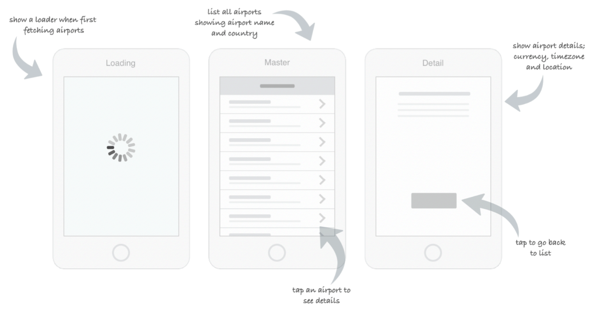

# Qantas Code Challenge (Web)

## Brief

You have been tasked with the job of giving Qantas customers the ability to view which
airports Qantas currently operates from. As part of this task you will build a mobile
responsive app which will load the list of airports from an API and present them to
users, as illustrated in the following wireframe:

An airports JSON API is available at https://api.qantas.com/flight/refData/airport
. For the details screen, you should use whichever UI components you deem
appropriate, given available airport details.

You are allowed to use any tools and libraries to solve this challenge. At a minimum we
require that the app will run on Google Chrome:

The deliverables for the challenge are:

- A responsive web application.
- Any supporting documentation or instructions needed to run the app.

Must have(s):

- A project that runs on Google Chrome.
- Appropriate unit testing coverage.
- Allows you to navigate and view airport detail (details page)
- README detailing how to compile/run the app (if needed)

Optional - Nice to have(s):

- Handle API failures
- Handle no network connectivity (caching)
- Attractive UI (animations etc)

# Solution

The codebase in this repository is the solution to the problem mentioned above.

## How to install

`npm install` or `yarn install` to install the dependencies

`npm run dev` or `yarn dev` to run the development server

`npm run test --detectOpenHandles` or `yarn test --detectOpenHandles` to run the test scripts

`http://localhost:3000/` to view the project
